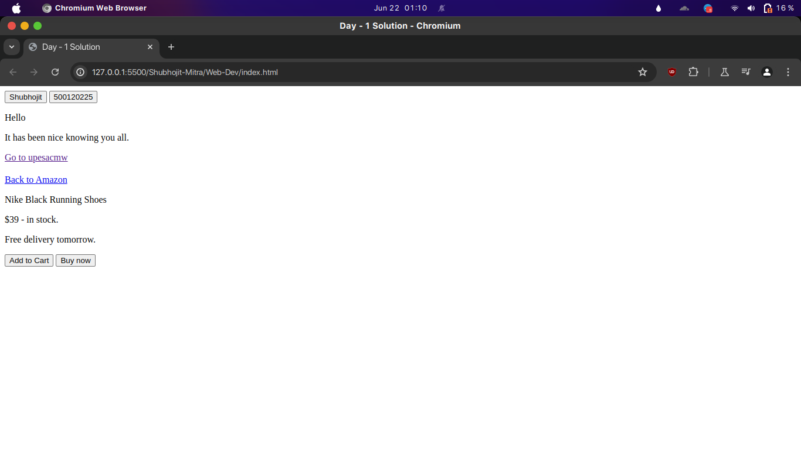
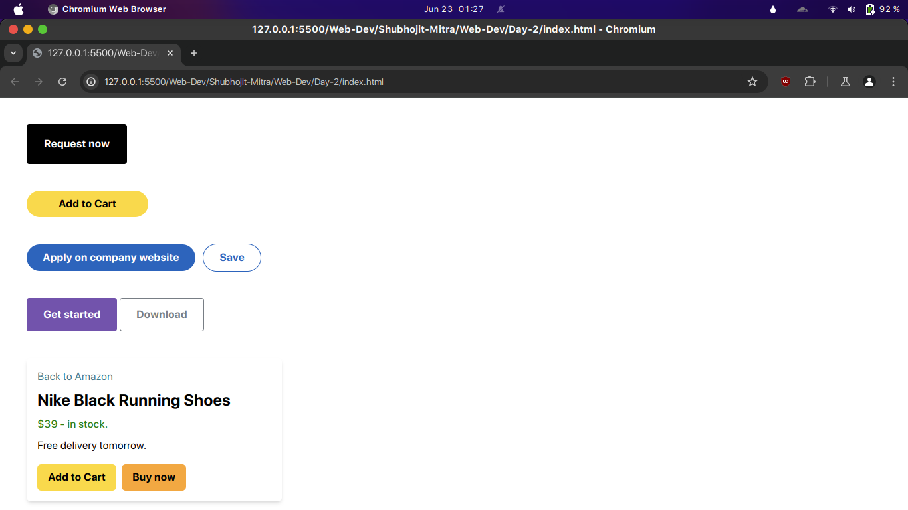

# Shubhojit Mitra - 21DaysOfCode

## Web Dev

### Day - 1

- #### index.html

```html
<!DOCTYPE html>
<html lang="en">
<head>
    <meta charset="UTF-8">
    <meta name="viewport" content="width=device-width, initial-scale=1.0">
    <title>Day - 1 Solution</title>
</head>
<body>
    <div class="one">
        <button>Shubhojit</button>
        <button>500120225</button>
    </div>
    <div class="two">
        <p>Hello </p>
        <p>It has been nice knowing you all.</p>
    </div>
    <div class="three-and-four">
        <a href="http://www.upesacmw.org" target="_blank">Go to upesacmw</a>
    </div>
    <div class="five" style="padding-top: 20px;">
        <a href="http://www.amazon.in" target="_blank">Back to Amazon</a>
        <p>Nike Black Running Shoes</p>
        <p>$39 - in stock.</p>
        <p>Free delivery tomorrow.</p>
        <button>Add to Cart</button>
        <button>Buy now</button>
    </div>
</body>
</html>
```
- ### Solution



---
### Day - 2

- #### index.html

```html
<!DOCTYPE html>
<html>
  <head>
    <meta charset="UTF-8" />
    <meta name="viewport" content="width=device-width, initial-scale=1.0" />
    <link href="./dist/output.css" rel="stylesheet" />
  </head>
  <body>
    <div class="m-10">
      <button class="bg-black text-white font-bold py-4 px-6 rounded block border-2 border-transparent border-black hover:text-black hover:bg-gray-200">
        Request now
      </button>
    </div>
    <div class="ml-10 mb-10">
      <button class="bg-[#f9d94c] hover:bg-yellow-500 text-black font-bold py-2 px-12 rounded-full">
        Add to Cart
      </button>
    </div>
    <div class="ml-10 mb-10">
      <button class="bg-[#2d64bc] hover:bg-blue-900 text-white font-bold py-2 px-6 rounded-full">
        Apply on company website
      </button>
      <button class="bg-white hover:bg-[#2d64bc] text-[#2d64bc] hover:text-white font-bold py-2 px-6 rounded-full border border-solid border-[#2d64bc] ml-2">
        Save
      </button>
    </div>
    <div class="ml-10 mb-10">
      <button class="bg-[#7253ac] text-white font-bold py-3 px-6 rounded border border-solid border-[#7253ac]">
        Get started
      </button>
      <button class="bg-white text-[#787e85] font-bold py-3 px-6 rounded border border-solid border-[#787e85]">
        Download
      </button>
    </div>
    <div class="bg-white shadow-md rounded-md p-4 w-96 mx-10">
      <a href="http://www.amazon.in" target="_blank" class="text-[#3f798c] underline">
        Back to Amazon
      </a>
      <h2 class="text-2xl font-bold mt-2">
        Nike Black Running Shoes
      </h2>
      <p class="text-[#307f16] font-medium mt-2">$39 - in stock.</p>
      <p class="mt-2">Free delivery tomorrow.</p>
      <div class="flex mt-4">
        <button class="bg-[#f9d94c] hover:bg-yellow-500 text-black font-bold py-2 px-4 rounded-md mr-2">
          Add to Cart
        </button>
        <button class="bg-[#f2a842] hover:bg-orange-500 text-black font-bold py-2 px-4 rounded-md">
          Buy now
        </button>
      </div>
    </div>
  </body>
</html>
```
- ### Solution



---

### Day-2

- #### index.html

